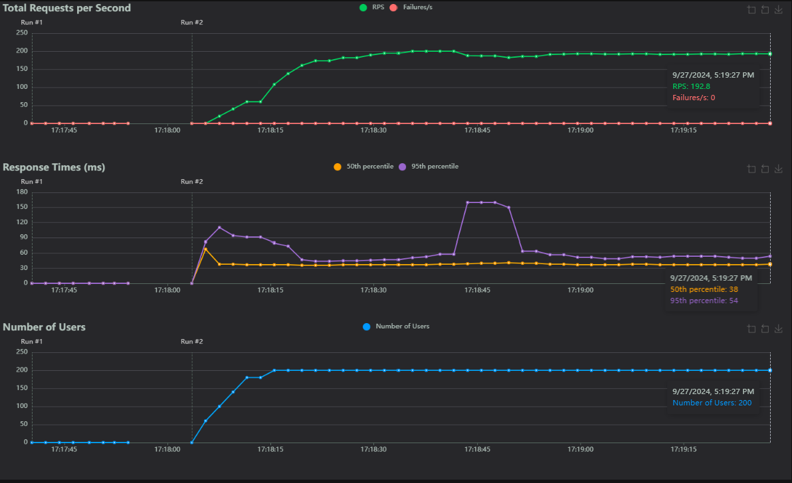
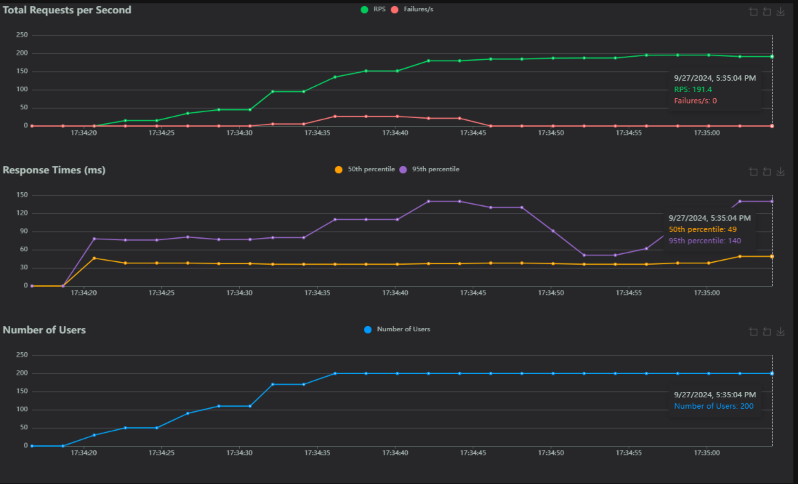
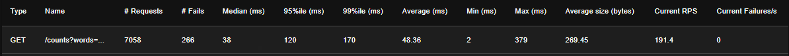

# counterMag - A distributed, in-memory database specialized in occurence counting

## Estimari

- Cereri analiza text: 200 req / s cu <200ms timp de raspuns
- Dimensiune medie text: 200 cuvinte (inspirat de [aici](https://www.emag.ro/telefon-mobil-samsung-galaxy-s24-ultra-dual-sim-12gb-ram-256gb-5g-titanium-black-sm-s928bzkgeue/pd/DP6L7KYBM/))

- Cereri citire text:  200 req / s cu <200ms timp de raspuns
- Nr mediu cuvinte cerute per interogare: 20

## Cerinte functionale

- Analizeaza un text si stocheaza numarul de aparitii pentru fiecare cuvant
- Obtine numarul de aparitii pentru un set de cuvinte date
- Datele sa persiste in urma repornirii aplicatiei

## Cerinte non-functionale

- Sa poata scala prin cresterea numarului de instante pentru a face fata workload-ului
- Consistenta eventuala
- Sistemul sa ramana functional daca una din instante devine indisponibila


## Persistenta

Persitenta bazei de date este impementata prin salvarea periodica a continutului acesteia intr-un fisier `counter-{instanceId}.log`, unde `instanceId` este ID-ul unic al instantei de baza de date.

Modul prin care se realizeaza acest lucru este vizibil la nivelul clasei [`Database`](/internal/database/database.go#L79). Pentru a persista continutul, clasa `Database` foloseste un struct care implementeaza interfata [`SnapshotPersister`](/internal/database/snapshot.go#L11). Aceasta interfata expune metodele `SaveSnapshot` si `LoadSnapshot` care sunt folosite pentru scrierea, respectiv citirea unui snapshot intr-un mod definit de orice `struct` care implementeaza interfata respectiva.

In practica, struct-ul concret folosit este [`FileSnapshotPersister`](/internal/database/snapshot.go#L16), care salveaza cheile din baza de date in formatul `<cheie> <valoare>`, separate de caracterul `\n`

Aceasta interfata a aparut din nevoia de testare a clasei `Database` fara a interactiona in mod direct cu file system-ul, in teste fiind folosit [`MockPersister`](/internal/database/snapshot.go#L71) care doar tine datele nemodificate intr-un camp.

Datele sunt salvate periodic folosind un goroutine separat pornit prin apelul functiei [`StartPeriodicFlush`](/internal/database/database.go#L94). Aceasta este apelata implicit in functia constructor [`NewDatabase`](/internal/database/database.go#L18).

Acest goroutine este oprit in momentul in care contextul folosit de `Database` este 'oprit'.

`Database` exporta si functia [`Close`](/internal/database/database.go#L110) care este apelata la momentul opririi aplicatiei cu un [timeout](/cmd/countermag/main.go#L79) ca parte din procesul de graceful shutdown pentru a evita pierderea datelor.


## Replicare

Aplicatia expune doua servere HTTP:
- cel de aplicatie, responsabil de analiza textelor si interogarile pentru aparitiile de cuvinte
- cel de cluster, responsabil de facilitatea comunicarii intre instantele de baza de date

Modelul de replicare ales este cel de `master-slave`, dupa cum urmeaza:
- fiecare instanta este pornita cu flag-urile `cluster` si `port`, unde `cluster` reprezinta adresa nodului master in format `host:port` si `port` reprezinta portul pe care va rula nodul curent
- daca portul nodului curent coincide cu portul din adresa nodului master, nodul curent va porni ca master, altfel se va conecta la master si acesta il va inregistra ca slave
- scrierile vor merge catre master si vor fi replicate periodic catre slaves
- citirile vor merge catre slaves

Este de mentionat ca rutarea scrierilor si citirilor este revizitata la sectiunea de [Imbunatatiri](#imbunatatiri)

Rutele expuse de serverul de cluster sunt urmatoarele:
- `GET  /cluster` - apelat pe nodul master va intoarce toate nodurile conectate la cluster alaturi de portul si starea lor
- `PUT  /store` - apelat periodic de catre master pentru fiecare dintre nodurile slave pentru a sincroniza baza de date
- `POST /connect` - apelat de catre slaves catre master pentru a se alatura clusterului
- `GET  /ping` - folosit de master pentru a verifica periodic starea nodurilor slave

Logica pentru apelarea acestor endpoint-uri a fost incapsulata in [`ClusterClient`](/internal/cluster/client.go#L11)


### Availability

Pentru a satisface proprietatea de `Availability` din teorema CAP, nodul master trimite catre fiecare nod slave un snapshot actualizat al bazei de date la un interval de 5 secunde (in conditii reale va fi mai scrut, dar durata aceasta a fost aleasa pentru a putea verifica cu usurinta replicarea in scopul testului tehnic)

### Partition Tolerance

Pentru a satisface proprietatea de `Partition tolerance` din teorema CAP, fiecare nod va continua sa deserveasca request-urile aferente aplicatiei chiar daca devine izolat de restul nodurilor, iar sistemul cu totul va deservi in continuare request-uri chiar daca unul dintre noduri devine indisponibil

In implementarea curenta exista problema de "ce se intampla daca nodul master devine indisponibil"? Acest lucru este detaliat la sectiunea [Imbunatatiri](#imbunatatiri)

## API

Serverul de cluster a fost detaliat la sectiunea [Replicare](#replicare)

Serverul de aplicatie expune 2 rute:
- `POST /analysis` - primeste un text de analizat in formatul 
```json
{
    "text": "<text>"
} 
```
- `GET  /counts` - primeste o lista de cuvinte separate de caracterul `,` in query string pentru care va intoarce numarul de aparitii in formatul 
```json
{
    "<cuvant>": "<numar_de_aparitii>"
}
```


## Rulare 

### Direct

Pentru o rulare rapida a unui nod, pot fi folosite comenzile: </br>

`go run cmd/countermag/main.go --cluster 127.0.0.1:8000 --port 8000` - porneste nod master </br>

`go run cmd/countermag/main.go --cluster 127.0.0.1:8000 --port 8001` - porneste nod slave


### Makefile

In [Makefile](/Makefile) sunt expuse urmatoarele recipe-uri:
- Rulare
  - `make build` - compileaza codul
  - `make run` - compileaza si ruleaza codul cu un singur nod master
  - `make run/live` - ruleaza codul si faciliteaza live-reloading in scopuri de dezvoltare
  - `make run/replicated` - porneste un nod master si un nod slave
- Testare
  - `make test/unit` - ruleaza testele unitare
  - `make test/load` - ruleaza un [load test](/scripts/load.sh) timp de 10 secunde cu 200 req / s; necesita o instalare de python cu dependintele specificate in acest [requirements.txt](/tests/load/requirements.txt)
  - `make test/replication` - ruleaza un [test simplu](/tests/replication/replication.py) de replicare ce consta in pornirea unui nod master si a unui nod slave, analiza unui text si doua comparatii intre datele tinute in cele doua noduri; necesita o instalare de python cu dependintele specificate in acest [requirements.txt](/tests/replication/requirements.txt)
- Utilitare
  - `make tidy` - formateaza codul si actualizeaza dependintele
  - `make clean` - sterge toate artefactele

## Testare

Testele de performanta au fost efectuate pe un VM din GCP de tip `n2-standard-2` cu 2vCPU si 8GB memorie.

Pentru testare am folosit [Locust](https://locust.io/)

Payload-ul folosit este cel de [aici](/tests/load/data/text.py#L1), format din 232 cuvinte

### 1 request

Timp mediu (1 request, 1 nod) analiza: 36ms
Timp mediu (1 request, 1 nod) nr aparitii pentru toate cuvintele: 36ms

Din aceste 36ms, aproximativ 35ms provin din latenta din retea. Procesarea propriu-zisa pe server a fost efectuata in <5ms
Testele pentru 1 singur request nu sunt relevante. Mai jos pot fi observati timpii de raspuns pentru (200 req / s, 1 nod):

### Mai multe request-uri | Analiza text


<p align="center">
  
  <br/>
</p>
<p align="center">
  
  <br/>
</p>

Putem observa cum 99%ile in response time este sub 200ms

### Mai multe request-uri | Interogare aparitii

<p align="center">
  
  <br/>
</p>
<p align="center">
  
  <br/>
</p>

Ca in cazul anterior, 99%ile se situeaza sub 200ms

## Demonizare

Aplicatiei este implementata in `Go` si distribuita sub forma unui binar de sine statator.
Acest binar poate fi integrat cu usurinta cu `systemd` pentru demonizare

## Logging

Pentru logging este folosit pachetului [`logging.py`](/internal/logging/logging.go). Acesta este implementat pe baza pachetului `log/slog` si acestui [articol](https://dusted.codes/creating-a-pretty-console-logger-using-gos-slog-package), din moment ce implementarea logger-ului in sine este inafara obiectivului testului tehnic.

Functia [`GetLogger`](/internal/logging/logging.go#L58) primeste `environment` ca parametru.
Daca este rulat in mediul `local` (ca in cadrul acestui test) output-ul va aparea in consola intr-un format mult mai inteligil pentru operator.

Alternativ, pentru alte medii (cum ar fi cel din Cloud) este folosit `NewJSONHandler` care va rezulta intr-un format usor de parsat pentru agenti de logging din cloud, cum este cel din GCP.

Pe acest pachet se bazeaza si middleware-ul [`AddLogging`](/internal/http/middleware/middleware.go#L10), folosit de cele 2 servere HTTP pentru a include informatii despre durata fiecarui request.

## Imbunatatiri

### Performanta & bottlenecks

#### Model replicare
Am folosit modelul master-slave pentru replicare, ceea ce duce la un read throughput crescut. Toate scrierile trec prin nodul master, evitand astfel potentiale conflicte de scriere, dar in acelasi timp transformand-ul intr-un potential bottleneck daca vin multe request-uri de analiza text.

Din implementarea curenta lipseste un mecanism de failover care sa permita unui slave sa preia rolul de master in cazul in care acesta devine indisponibil.

Daca exista flexibilitate cu privire la exactitatea numarului de aparitii, putem creste write throughput-ul folosind un model replicare master-master pentru nu fi limitati de un singur nod folosit pentru scrieri

#### Offloading

Nodurile care stocheaza datele sunt aceleasi care proceseaza textul. In cazul de fata, procesarea este relativ simpla si nu necesita prea multe resurse. In cazul unui pipeline mai complex, aceasta procesare ar trebui offload-uita unori noduri de tip worker care sa trimita catre baza de date doar rezultatul.

### Configuratie

Exista mai multe aspecte ale implementarii curente care ar sta mai bine intr-un struct ipotetic `Config` populat din varii surse (variabile de mediu, fisier, argumente in linia de comanda). Cateva exemple sunt:
- intervalul de sincronizare master-slave
- mediul in care ruleaza aplicatia
- IP-ul cluster-ului
- calea catre fisierul de persitenta

### Masuri protectie SQL injection, XSS etc (provocari suplimentare 3)

#### SQL Injection

SQL injection-ul poate fi evitat prin folosirea functiilor corespunzatoare la momentul construirii query-ului de trimis catre baza de date.

In cazul `Go` cu pachetul [`database/sql`](https://pkg.go.dev/database/sql), un cod vulnerabil la acest atac ar fi: 

```go
db.Query("SELECT name FROM users WHERE age=" + req.FormValue("age"))
```

Problema aici este ca valoarea parametrului `age` este concatenata direct in query si trimis catre DB

Alternativa sigura ar fi:

```go
db.Query("SELECT name FROM users WHERE age=?", req.FormValue("age"))
```

Prin folosirea placeholder-ului `?` pentru valoare, la DB vor ajunge query-ul si valoarea aferenta placeholder-ului separat. In forma acesata, query-ul nu va fi executat daca valoarea parametrului `age` contine caractere ilegale

De asemenea, putem efectua propria sanitizare inainte de a ajunge macar la DB.

#### XSS

Pentru inceput, atat pentru SQL Injection, cat pentru XSS putem efectua sanitizare asupra oricarui input in sistemul nostru. Ambele sunt vulnerabilitati solutii cunoscute care ar trebui sa fie standard in orice aplicatie web.

Cativa pasi pentru prevenirea XSS sunt:
- sanitizarea inputului
- folosirea header-ului de `content-type` corespunzator
- verificarea framework-urilor vis-a-vis de aceste vulnerabilitati inainte de a le folosi